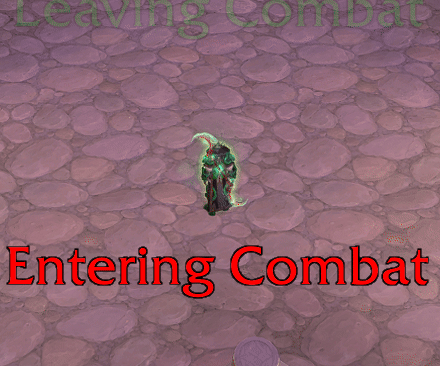

# Floating Combat Alert

Super lightweight addon that shows floating text when you enter or leave combat. Type `/fca` in chat to open the configuration window.

## Commands

- `/fca` — open the configuration window
- `/fca reset` — restore default settings

Any other input opens the window as well.

## The config window

- **move region** — show the travel region editor, then drag it anywhere or drag its top/bottom edges to resize it; the region always hugs the text width. Closing the window hides the editor.
- **Link** — when checked, that row edits both alerts together; unchecked edits Entering and Leaving separately
- **Font / Size / Color / Outline** — the look of each alert's text
- **Text** — the words each alert shows
- **Direction** — whether the text travels up or down
- **Duration** — seconds between spawning and despawning
- **Fade start** — percent of the duration at which fading out starts
- While the window is open, sample messages keep flying so you can tune the settings while watching.

## Compatibility

World of Warcraft: Midnight (12.1.0)

## Links

- [Changelog](CHANGELOG.md)
